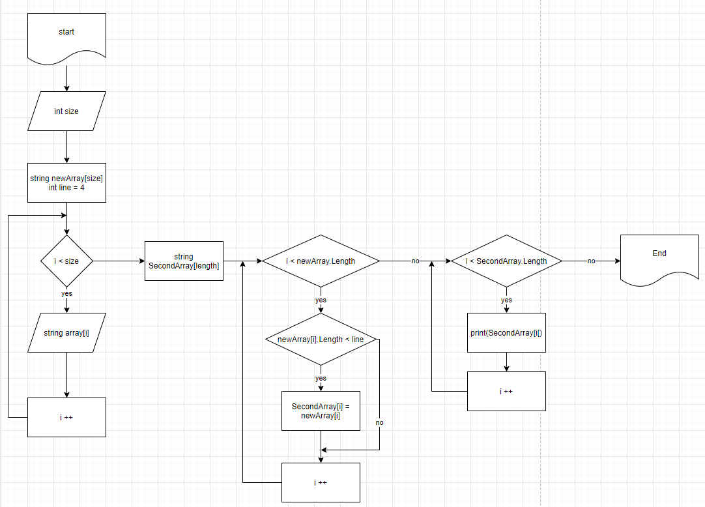

# Финальный проект. FinalC#

## **_Задача:_**
Написать программу, которая из имеющегося массива строк формирует массив из строк, длина которых меньше, либо равна 3 символам. Первоначальный массив можно ввести с клавиатуры, либо задать на старте выполнения алгоритма. При решении не рекомендуется пользоваться коллекциями, лучше обойтись исключительно массивами. 

## _Примеры:_
["hello", "2", "world", ":-)"] -> ["2", ":-)"]

["1234", "1567", "-2", "computer science"] -> ["-2"]

["Russia", "Denmark", "Kazan"] -> []

## *Алгоритм:*

Создание блок-схемы.

Где мы получаем от пользователя размер массива. Учитывая, что в c# нельзя сделать массив безразмерным, этот этап крайне важен. Следующим запросом мы создаем массив строк через цикл for. 

Здесь же важно задать условие в три символа для длины строки. Чтобы избежать магических чисел в программе, мы создаем переменную-константу. 

По условию задачи не требовалось, но при желании сделать программу универсальнее, мы можем эту переменную запросить у пользователя, задав ее через метод Convert.ToInt32(Console.ReadLine()); 

Далее, обращаясь к скрипту, я написала метод, который выводит созданный массив в консоль, для того, чтобы убедиться, что пользователь ввел массив и все прошло хорошо. В блок-схеме, я этого этапа не отражала, во-первых, потому что для вывода и пользовательского и отобранного массива использую один и тот же метод, а во-вторых, это лишь промежуточный этап, чтобы отследить правильность работы программы. 

Итак, далее мы переходим к "вкусному" методу, ради которого все и затевалось. Он оказался до банальности прост, что не означает, что нельзя его улучшить или докрутить под нужную задачу. 

В нем, мы в цикле for проходим по всем элементам полученного в аргументах метода массива и длину каждой строки сравниваем с константой. 

Последний, итоговый цикл выводит получившийся массив строк в терминал, также через цикл for. Важно сделать это именно через цикл, потому что в c# нельзя напрямую вывести массив в терминал. Нам бы в любом случае пришлось бы создать под это метод. 

Последний, итоговый цикл выводит получившийся массив строк в терминал, также через цикл for. Важно сделать это именно через цикл, потому что в c# нельзя напрямую вывести массив в терминал. Нам бы в любом случае пришлось бы создать под это метод. 